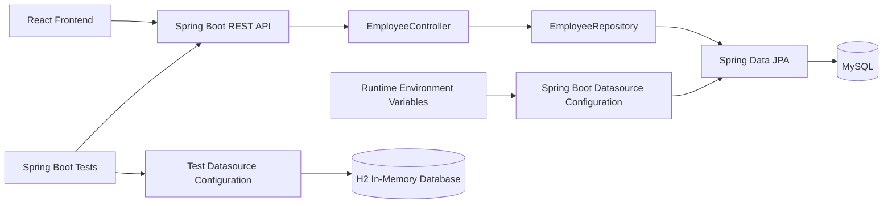

# Architecture Design: AA-54 Secure Database Credentials Configuration

## Architecture Style

Retain the existing layered monolith:

- React frontend
- Spring Boot REST API
- Spring Data JPA repository layer
- MySQL for local and production runtime
- H2 in-memory database for automated tests

The change is isolated to datasource configuration and documentation. No API or domain behavior changes are required.

## Component Diagram



## Technology Choices

- **Spring Boot 2.7:** Existing backend framework and native environment-variable property resolution.
- **Spring Data JPA:** Existing persistence abstraction; no change needed.
- **MySQL:** Retained for local and production runtime compatibility.
- **H2:** Retained for automated tests, avoiding dependency on external credentials or a live MySQL server.
- **Environment variables:** Runtime-only credential injection without adding a secret-management dependency.
- **Maven:** Existing build and test tooling.

## Data Flow

1. The runtime supplies datasource settings through environment variables.
2. Spring Boot resolves those values into `spring.datasource.*` properties.
3. Spring Boot creates the datasource and JPA entity manager.
4. Existing controllers and repositories use the configured datasource without code changes.
5. Test execution continues to load the test-specific H2 configuration, keeping tests independent of production credentials.
6. When required runtime settings are absent, datasource initialization fails during application startup with a non-secret configuration error.

## Proposed Runtime Variables

- `DB_URL`
- `DB_USERNAME`
- `DB_PASSWORD`

The main configuration will use Spring placeholders with no real defaults:

```properties
spring.datasource.url=${DB_URL}
spring.datasource.username=${DB_USERNAME}
spring.datasource.password=${DB_PASSWORD}
```

The exact variable names will be documented for local, test, and production operators.

## API Contracts

No API contracts change as part of AA-54. Existing contracts remain:

- `GET /api/employees` returns a collection of employees.
- `POST /api/employees` accepts an employee payload and returns the created employee.
- `GET /api/employees/{id}` returns one employee or the existing not-found response.
- `PUT /api/employees/{id}` accepts updated employee fields and returns the updated employee.
- `DELETE /api/employees/{id}` deletes the employee and returns `204 No Content`.

## Data Model

The existing `Employee` entity remains unchanged:

- `id`
- `firstName`
- `lastName`
- `emailId`

No schema, relationship, or persistence behavior changes are introduced.

## Security Considerations

- Remove plaintext database username and password from tracked configuration.
- Supply credentials only through the runtime environment.
- Do not provide real credential defaults in configuration or documentation.
- Do not include credential values in startup or connection error messages.
- Do not log datasource passwords or complete connection strings if they contain secrets.
- Keep secret scanning limited to currently tracked files, matching the approved requirements.
- Authentication and authorization are outside the scope of AA-54 and remain unchanged.

## Infrastructure

- **Local:** Developers export `DB_URL`, `DB_USERNAME`, and `DB_PASSWORD` before starting the backend.
- **Automated tests:** Tests continue using the existing H2 test configuration.
- **Production:** Deployment infrastructure supplies the same variables through its environment configuration.
- **Scaling:** No scaling changes are needed; the existing stateless REST service and database deployment model remain intact.
- **Deployment:** Build artifacts contain configuration placeholders only; credentials are injected at process startup.

## Startup Failure and Observability

- Missing or malformed datasource settings cause startup to fail rather than falling back to defaults.
- Startup diagnostics may identify only the variable name, failure category, application environment, and remediation guidance. They must never include variable values, passwords, usernames, complete JDBC URLs, connection strings, or nested exception text that may contain them.
- Missing configuration is classified as a permanent configuration failure. Database authentication, DNS, or connectivity failures are classified as database connection failures; the process exits and deployment supervision determines whether to restart it, without application-level indefinite retries.
- Deployment or process supervision detects a non-zero startup exit and raises the environment's standard deployment alert. Operators correct missing or malformed environment variables or restore database availability before restarting the service.
- Existing framework startup logs and deployment health reporting are the operational integration points. Readiness is considered unavailable until datasource initialization succeeds; no new endpoint or monitoring service is introduced for this configuration-only change.

## Verification Matrix

| Scenario | Expected result |
|---|---|
| `DB_URL`, `DB_USERNAME`, and `DB_PASSWORD` are valid | Application starts and connects to MySQL. |
| Each required variable is missing individually | Startup fails and identifies only the missing variable name. |
| URL is malformed or credentials are invalid | Startup fails with a safe failure category; no value, password, username, or full URL is exposed. |
| Production variables are absent during tests | Existing H2 test configuration keeps tests independent of production variables. |
| Existing employee API workflows execute | Existing responses and persistence behavior remain unchanged. |
| Tracked-file secret scan runs | Scan passes with no plaintext database credentials found. |

## Key Design Decisions

- **AD-001: Use Spring property placeholders.** Spring Boot already supports environment-variable resolution, minimizing implementation risk and avoiding custom configuration code.
- **AD-002: Use `DB_URL`, `DB_USERNAME`, and `DB_PASSWORD`.** These names clearly separate runtime database settings from application source and are easy to document across environments.
- **AD-003: Keep H2 test configuration independent.** Tests already use an in-memory H2 database, so they should not require production-style credentials or a live MySQL instance.
- **AD-004: Fail fast when runtime settings are missing.** Missing required values should prevent startup and produce a clear, non-secret error rather than silently using unsafe defaults.
- **AD-005: Preserve all existing REST and persistence interfaces.** AA-54 is a security configuration change, so the controller, entity, repository, and frontend contracts remain unchanged.
- **AD-006: Limit remediation to currently tracked files.** Full Git-history remediation and credential rotation are explicitly outside the approved scope.