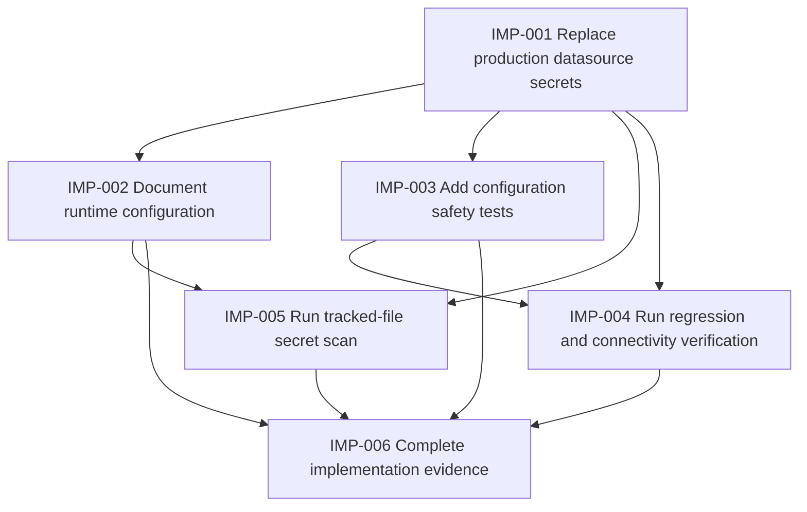

# Implementation Plan: AA-54 Secure Database Credentials Configuration

## Task Table

| ID | Title | Description | Dependencies | Estimated Effort | Status |
|---|---|---|---|---|---|
| IMP-001 | Replace production datasource secrets | Update `springboot-backend/src/main/resources/application.properties` to use `DB_URL`, `DB_USERNAME`, and `DB_PASSWORD` placeholders with no real defaults. Preserve existing non-secret datasource and JPA settings. | None | 15 minutes | Done |
| IMP-002 | Document runtime configuration | Update the backend setup documentation with local, test, and production configuration instructions, placeholder examples, required variable names, and safe handling guidance. Do not add real credentials. | IMP-001 | 30 minutes | Done |
| IMP-003 | Add configuration safety tests | Add focused Spring Boot tests covering missing variables, malformed datasource configuration, safe failure diagnostics, and independence from production variables. Use the existing H2 test configuration and avoid asserting or logging secret values. | IMP-001 | 60 minutes | Done |
| IMP-004 | Run regression and connectivity verification | Run the backend test suite, verify the existing H2 context and employee persistence/API behavior, and verify MySQL startup/connectivity when valid runtime variables and an available database are provided. | IMP-001, IMP-003 | 45 minutes | Done |
| IMP-005 | Run tracked-file secret scan | Scan currently tracked files for plaintext database credentials and confirm generated/build artifacts do not reintroduce them. Record the exact command and result in verification evidence. Git history remediation is excluded. | IMP-001, IMP-002 | 15 minutes | Done |
| IMP-006 | Complete implementation evidence | Confirm each acceptance criterion, document any environment-dependent limitation, and prepare the implementation changes for Phase 6 code review. | IMP-002, IMP-003, IMP-004, IMP-005 | 20 minutes | Done |

## Dependency Graph

## Blocked Tasks

- **IMP-002** is blocked by IMP-001 so the documentation reflects the final runtime property names and configuration shape.
- **IMP-003** is blocked by IMP-001 so tests target the actual environment-backed datasource configuration.
- **IMP-004** is blocked by IMP-001 and IMP-003 because regression verification requires the implementation and focused safety tests.
- **IMP-005** is blocked by IMP-001 and IMP-002 so both active configuration and documented examples can be scanned together.
- **IMP-006** is blocked by all implementation and verification tasks.

## Implementation Notes

- Use Spring property placeholders in the main properties file: `${DB_URL}`, `${DB_USERNAME}`, and `${DB_PASSWORD}`. Do not add fallback values.
- Keep `src/test/resources/application.properties` on H2 so tests do not require MySQL credentials or production environment variables.
- Prefer testing application-context startup behavior through Spring Boot test configuration rather than introducing custom datasource code.
- Startup diagnostics must expose only a missing variable name or safe failure category. Do not print passwords, usernames, complete JDBC URLs, connection strings, or unfiltered nested exception messages.
- Treat missing or malformed settings as permanent configuration failures. Treat authentication, DNS, and connectivity errors as database connection failures; do not add indefinite application-level retries.
- Use the existing backend Maven commands and test framework. A live MySQL verification requires externally supplied valid values and an available database; it must never use committed credentials.
- Secret scanning is limited to currently tracked files as required by AA-54. Do not rewrite Git history or rotate credentials in this story.
- Do not modify controller routes, entity fields, repository contracts, frontend behavior, or database schema.

## Definition of Done

Each task is complete only when its code or documentation changes are focused, reviewed locally, and its relevant validation passes.

The implementation plan is complete when:

1. No plaintext database credentials remain in currently tracked source, configuration, documentation, or generated tracked artifacts.
2. The application requires `DB_URL`, `DB_USERNAME`, and `DB_PASSWORD` at runtime for the MySQL datasource and has no unsafe defaults.
3. Local, test, and production operators have documented configuration steps using placeholders only.
4. Missing and malformed configuration fails fast with diagnostics that do not expose secret values or full connection details.
5. Existing H2 tests pass without production variables, and existing employee API and persistence behavior remains unchanged.
6. Valid externally supplied MySQL settings are verified when an available database is provided, or the environment limitation is explicitly recorded.
7. The tracked-file secret scan passes, with its command and result retained as verification evidence.
8. All implementation changes are ready for the Phase 6 code review, with no unrelated files or behavior changes.

## Implementation Evidence

- **Focused safety tests:** `springboot-backend\\mvnw.cmd -Dtest=DatasourceConfigurationSafetyTest test` with process-local `JAVA_HOME=C:\\Program Files\\Java\\jdk-21.0.11`: 7 tests passed, 0 failures, 0 errors, 1 environment-assumption skip when external `DB_*` variables are unavailable, including the test-profile bypass, URL validation, and cause-chain redaction cases.
- **Full backend regression:** `springboot-backend\\mvnw.cmd test` with the same process-local `JAVA_HOME`: 8 tests passed, 0 failures, 0 errors, 1 environment-assumption skip. Existing H2 context tests passed with the explicit `test` profile and without production database variables.
- **Live MySQL connectivity:** TCP probe to `localhost:3306` was unreachable. Per approved implementation direction, live MySQL startup/connectivity is skipped on this machine; no credentials were requested or used.
- **Tracked-file scan:** `git ls-files` defined the 46-file scan boundary. Checks found no `spring.datasource.password=123456`, no hardcoded production datasource credentials, no tracked `target/` build output, and no credential-like literals beyond placeholders or safe test values. Git history remediation was not performed, as required.
- **Formatting and diagnostics:** `cmd /c "git diff --check 2>NUL"` passed, and editor diagnostics reported no errors in the validator or safety test.

### Acceptance Criteria Coverage

| Criterion | Evidence |
|---|---|
| No plaintext database credentials in tracked files | IMP-005 tracked-file scan passed. |
| Valid runtime configuration supports startup and database connection | Configuration uses `DB_URL`, `DB_USERNAME`, and `DB_PASSWORD`; live MySQL execution remains environment-limited because `localhost:3306` is unavailable. |
| Missing or invalid settings fail safely | IMP-003 safety tests passed for each missing variable and malformed URL; diagnostics exclude the test secret. |
| Developers can configure without editing tracked files | README documents runtime variables and placeholder-only setup. |
| Existing behavior remains unchanged | Full backend regression and existing H2 context passed. |
| Secret scan passes | IMP-005 scan passed across all tracked files. |